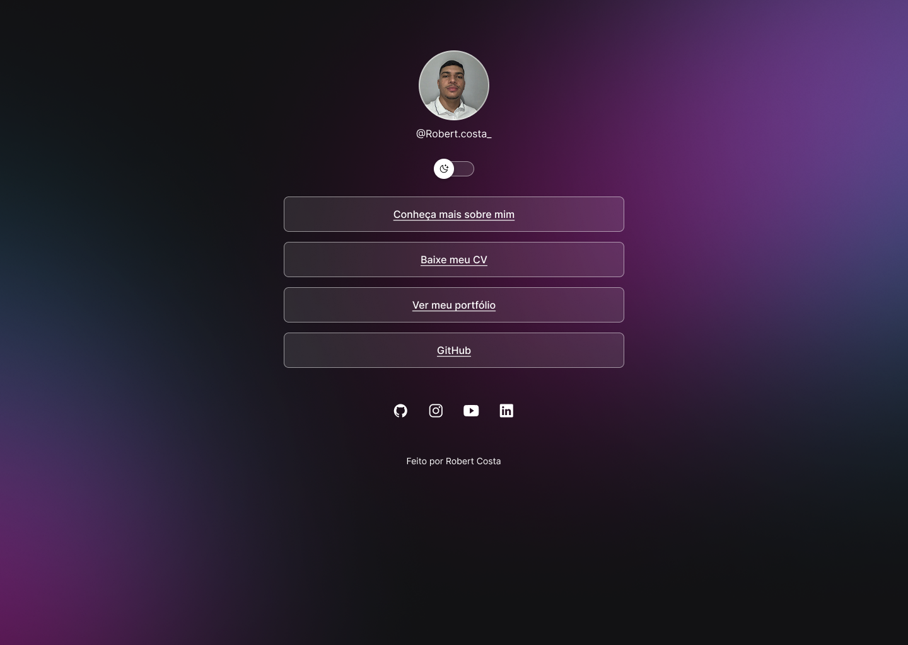

<h1 align="center"> DevLinks </h1>

Projeto desenvolvido com propósito didático.

  <a href="#-tecnologias">Tecnologias</a>&nbsp;&nbsp;&nbsp;|&nbsp;&nbsp;&nbsp;
  <a href="#-projeto">Projeto</a>&nbsp;&nbsp;&nbsp;|&nbsp;&nbsp;&nbsp;
  <a href="#-layout">Layout</a>&nbsp;&nbsp;&nbsp;|&nbsp;&nbsp;&nbsp;
  <a href="#memo-licença">Licença</a>

  

 

  

## Tecnologias

Esse projeto foi desenvolvido com as seguintes tecnologias:

- HTML e CSS
- JavaScript
- Git e Github
- Figma

## Projeto

O DevLinks é um agregador de links para usar como cartão de visitas online.

## Layout

Você pode visualizar o layout do projeto através [DESSE LINK](https://www.figma.com/design/eQwGZtYt54sQr4ye4aHpGQ/Sem-t%C3%ADtulo?node-id=0-1&p=f&t=e6EQBr1GoSPxfYLA-0). É necessário ter conta no [Figma](https://figma.com) para acessá-lo.

## Licença

Esse projeto está sob a licença MIT.

---

Feito por [Robert Costa](https://www.linkedin.com/in/robert-araujo-costa)